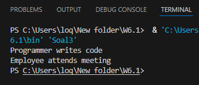

No 1. Output pada nomor 1 adalah meow
    Screenshotnya adalah sebagai berikut :
    

Penjelasan : Walaupun variabelnya bertipe Animal. Saat method sound() dipanggil, Java menjalankan method milik Cat yang telah di Override method dari animal.

No 2. Output pada nomor 2 adalah 
            Vehicle is moving
            Car is moving
    

Penjelasan : v1 membuat objek Vehicle, sehingga method yang dijalankan adalah move() milik Vehicle
             v2 membuat objek Car, sehingga walaupun variabelnya bertipe Vehicle, Java menjalankan method move() milik Car yang telah di Override method dari Vehicle.

No 3. Output pada nomor 3 adalah
            Programmer writes code
            Employee attends meetin
    

Penjelasan : Method work() di Override oleh class Programmer, sehingga yang dijalankann adalah method milik Programmer
             Method attendMeeting() tidak di Override, sehingga tetap menggunakan method yang di warisi dari class Employee.

BUKTI SCREENSHOT BERADA DI PROJECT (Images)

Credit : ChatGPT